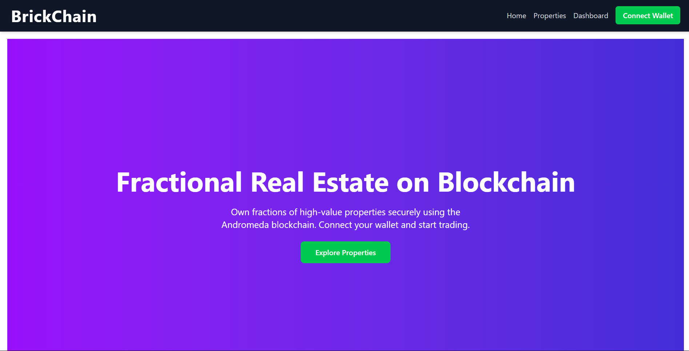
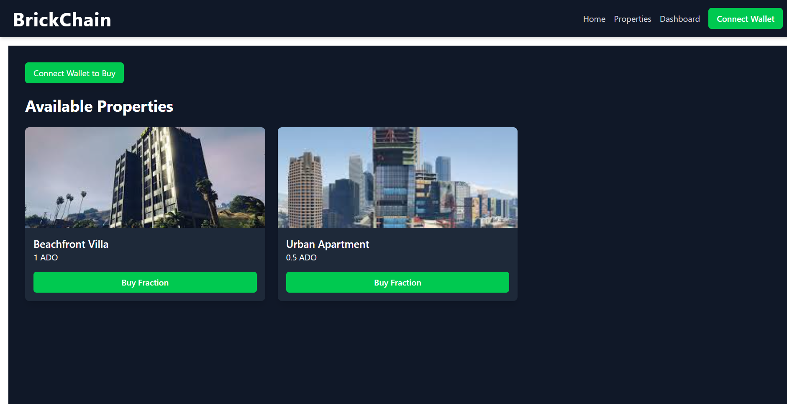
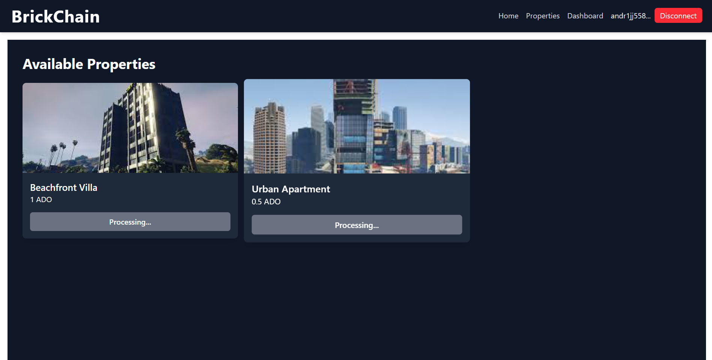

# BrickChain NFT Real Estate Marketplace

BrickChain is a React-based NFT real estate marketplace built on the Andromeda Protocol testnet.  
Users can explore properties as NFTs, see **valuation and trust scores**, and buy fractional ownership using ADO tokens.  

**Tech Stack:** React, Tailwind CSS, Framer Motion, CosmJS, Flask (API for valuation/fraud scores)
## Features
- Wallet connection via Keplr
- Browse available properties (NFTs)
- Display **valuation** and **trust score** for each property
- Buy fractional ownership through Marketplace ADO
- Responsive and interactive UI with Framer Motion

## Screenshots
### Home Page


### Property listing


### Purchase Fractional Property

## Setup

1. Clone the repository:
   ```bash
   git clone https://github.com/Navsajan/BrickChain.git
   cd brickchain
   npm install
   npm run dev

---

### 4️⃣ Usage / How It Works
Explain **how users interact with the app**.

```markdown
## Usage
1. Click **Connect Wallet** to link your Keplr wallet.
2. Browse the available properties.
3. View valuation and trust/fraud scores for each property.
4. Click **Buy Fraction** to purchase fractional ownership using ADO tokens.
5. Transactions will be processed on the Andromeda testnet.

## Contributing
Contributions are welcome! Please fork the repository and create a pull request.

## License
This project is licensed under the MIT License.
 
